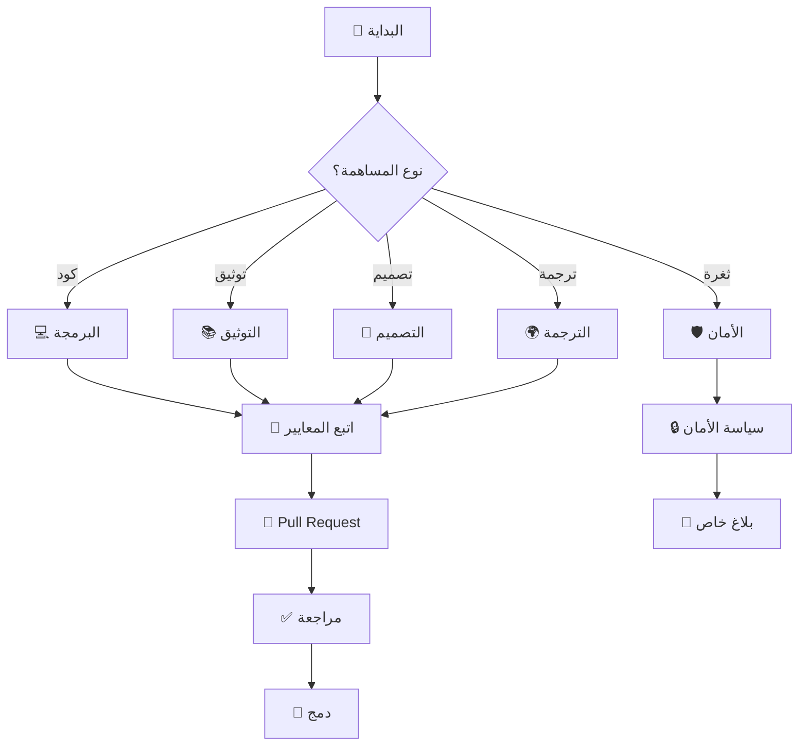
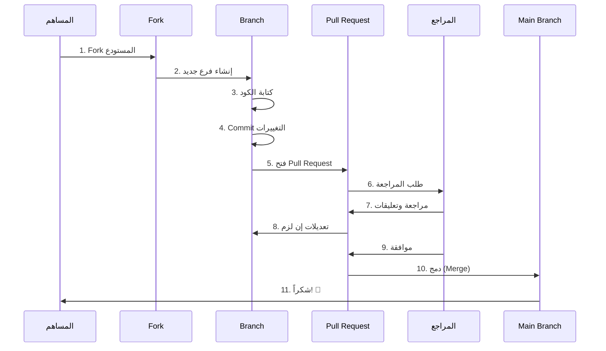
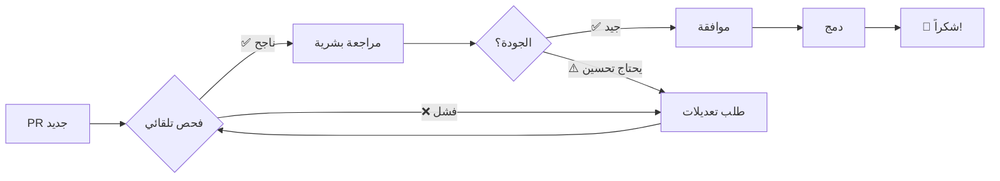

<div align="center">

# 🤝 دليل المساهمة – GENESIS LINK

[](CONTRIBUTING.md)
[](CODE_OF_CONDUCT.md)
[](LICENSE)

> 🧠 **كل مساهمة هنا تُكتب بروح المحارب الرقمي، وكل سطر كود يحمل أثرًا لا يُنسى.**

**نرحب بجميع المساهمين من كل المستويات - من المبتدئين إلى الخبراء!**

[🚀 البدء السريع](#-البدء-السريع) • [📋 أنواع المساهمات](#-أنواع-المساهمات) • [🔄 سير العمل](#-سير-العمل) • [📝 معايير الكود](#-معايير-الكود)

</div>

---

## 📖 جدول المحتويات



---

## 🌟 لماذا تساهم معنا؟

<table align="center">
<tr>
<td align="center" width="25%">
<h3>🎓 تعلّم</h3>
<p>اكتسب خبرة عملية في الأمن السيبراني والتطوير مفتوح المصدر</p>
</td>
<td align="center" width="25%">
<h3>🤝 تواصل</h3>
<p>انضم لمجتمع من المطورين والخبراء حول العالم</p>
</td>
<td align="center" width="25%">
<h3>🏆 تميّز</h3>
<p>ابنِ سمعتك وأضف مساهماتك لملفك المهني</p>
</td>
<td align="center" width="25%">
<h3>💡 أثّر</h3>
<p>ساهم في بناء بيئة أمنية أفضل للجميع</p>
</td>
</tr>
</table>

---

## 🚀 البدء السريع

### 1️⃣ **تجهيز البيئة**

```bash
# استنساخ المستودع
git clone https://github.com/genesis-link/repository.git
cd repository

# إنشاء فرع جديد
git checkout -b feature/your-feature-name

# تثبيت التبعيات
npm install
# أو
pip install -r requirements.txt

# تشغيل الاختبارات
npm test
# أو
pytest
```

### 2️⃣ **إعداد Git**

```bash
# إعداد المعلومات الشخصية
git config user.name "اسمك"
git config user.email "your.email@example.com"

# إعداد GPG Signing (اختياري لكن مُستحسن)
git config commit.gpgsign true
git config user.signingkey YOUR_GPG_KEY
```

### 3️⃣ **التحقق من جاهزية البيئة**

```bash
# تأكد من عمل كل شيء
npm run lint      # فحص الكود
npm run format    # تنسيق الكود
npm test          # تشغيل الاختبارات
npm run build     # بناء المشروع
```

---

## 📋 أنواع المساهمات

<div align="center">

### 🎯 **كل مساهمة مهمة، مهما كانت صغيرة!**

</div>

### 💻 **المساهمة بالكود**

<details>
<summary><b>🔽 انقر للتفاصيل</b></summary>

#### ✅ **ما نبحث عنه:**

- 🐛 إصلاح الأخطاء (Bug Fixes)
- ✨ ميزات جديدة (New Features)
- ⚡ تحسينات الأداء (Performance)
- 🔒 تحسينات أمنية (Security)
- 🧪 إضافة اختبارات (Tests)
- ♻️ إعادة هيكلة الكود (Refactoring)

#### 📝 **معايير الكود:**

```javascript
// ✅ جيد: كود واضح ومُوثّق
/**
 * تشفير النص باستخدام AES-256
 * @param {string} text - النص المراد تشفيره
 * @param {string} key - مفتاح التشفير
 * @returns {string} النص المشفّر
 */
function encrypt(text, key) {
  // تنفيذ التشفير
  return encryptedText;
}

// ❌ سيء: كود غير واضح
function e(t,k){return enc(t,k)}
```

#### 🎨 **أسلوب الكود:**

- استخدم أسماء متغيرات واضحة ومعبّرة
- اكتب تعليقات للأجزاء المعقدة
- اتبع معايير ESLint/Prettier المعرّفة
- أضف اختبارات لكل ميزة جديدة
- تأكد من عدم كسر الاختبارات الموجودة

</details>

---

### 📚 **المساهمة بالتوثيق**

<details>
<summary><b>🔽 انقر للتفاصيل</b></summary>

#### 📖 **أنواع التوثيق:**

| النوع | الوصف | الأمثلة |
|-------|-------|---------|
| 📘 **توثيق المستخدم** | شرح للمستخدمين النهائيين | أدلة الاستخدام، FAQ |
| 👨‍💻 **توثيق المطورين** | شرح تقني للمساهمين | API Docs, Architecture |
| 📝 **التعليقات في الكود** | شرح داخل الملفات | JSDoc, Docstrings |
| 🎬 **دروس تعليمية** | أدلة خطوة بخطوة | Tutorials, Guides |

#### ✍️ **معايير الكتابة:**

```markdown
✅ جيد:
# تثبيت المشروع

لتثبيت المشروع على جهازك، اتبع الخطوات التالية:

1. استنسخ المستودع
2. ثبّت التبعيات
3. شغّل الاختبارات

❌ سيء:
# تثبيت
git clone repo
npm i
```

#### 🌍 **الترجمة:**

- نرحب بترجمة الوثائق إلى لغات مختلفة
- احرص على دقة المصطلحات التقنية
- حافظ على التنسيق الأصلي
- أضف ملف `README.{lang}.md` (مثل: `README.ar.md`)

</details>

---

### 🎨 **المساهمة بالتصميم**

<details>
<summary><b>🔽 انقر للتفاصيل</b></summary>

#### 🖌️ **ما نحتاجه:**

- 🎨 تحسين واجهة المستخدم (UI)
- ✨ تحسين تجربة المستخدم (UX)
- 🖼️ تصميم الشعارات والأيقونات
- 📊 إنشاء رسوم بيانية توضيحية
- 🎬 تصميم مقاطع فيديو تعليمية

#### 🎯 **المبادئ التصميمية:**

```css
/* نتبع هذه المبادئ */
:root {
  --primary-color: #00ff00;      /* الأخضر: الأمان */
  --secondary-color: #0099ff;    /* الأزرق: التكنولوجيا */
  --accent-color: #ff6600;       /* البرتقالي: التحذير */
  --dark-bg: #1a1a1a;            /* خلفية داكنة */
  --text-color: #ffffff;         /* نص أبيض */
}
```

#### 📏 **معايير التصميم:**

- استخدم الألوان المعتمدة في المشروع
- تأكد من وضوح القراءة (Contrast)
- اتبع مبادئ الـ Accessibility
- اختبر التصميم على شاشات مختلفة

</details>

---

### 🛡️ **المساهمة الأمنية**

<details>
<summary><b>🔽 انقر للتفاصيل</b></summary>

#### ⚠️ **هام جداً:**

> **إذا وجدت ثغرة أمنية، لا تفتح Issue علني!**
> 
> اتبع [سياسة الأمان](SECURITY.md) وأرسل بلاغًا خاصًا إلى:
> 📧 `security@genesis-link.org`

#### 🔍 **المساهمات الأمنية المقبولة:**

- ✅ تحسينات عامة للأمان
- ✅ إضافة اختبارات أمنية
- ✅ تحديث التبعيات الضعيفة
- ✅ توثيق أفضل الممارسات الأمنية

#### 🔒 **معايير الكود الآمن:**

```python
# ✅ جيد: استخدام مكتبات موثوقة
from cryptography.fernet import Fernet
key = Fernet.generate_key()
cipher = Fernet(key)

# ❌ سيء: تشفير مخصص غير آمن
def my_encrypt(text):
    return text[::-1]  # مجرد عكس النص!
```

</details>

---

### 🐛 **الإبلاغ عن الأخطاء**

<details>
<summary><b>🔽 كيفية الإبلاغ عن خطأ</b></summary>

#### 📋 **قالب البلاغ:**

```markdown
## 🐛 وصف الخطأ
وصف واضح ومختصر للمشكلة

## 📝 خطوات إعادة الإنتاج
1. افتح '...'
2. انقر على '...'
3. لاحظ الخطأ

## ✅ السلوك المتوقع
ما كان يجب أن يحدث

## ❌ السلوك الفعلي
ما حدث فعلاً

## 🖥️ البيئة
- نظام التشغيل: [مثل: Ubuntu 22.04]
- الإصدار: [مثل: v2.5.0]
- المتصفح: [مثل: Chrome 120]

## 📸 لقطات الشاشة
إن وجدت

## 📎 ملفات إضافية
سجلات الأخطاء أو ملفات مرفقة
```

#### 🎯 **نصائح لبلاغ جيد:**

- ✅ كن واضحاً ومحدداً
- ✅ أضف لقطات شاشة إن أمكن
- ✅ ضمّن معلومات البيئة
- ✅ تأكد من عدم تكرار البلاغ
- ❌ لا تبلغ عن ثغرات أمنية علنياً

</details>

---

### 💡 **اقتراح ميزات جديدة**

<details>
<summary><b>🔽 كيفية اقتراح ميزة</b></summary>

#### 📋 **قالب الاقتراح:**

```markdown
## 💡 وصف الميزة
وصف واضح للميزة المقترحة

## 🎯 المشكلة التي تحلها
لماذا نحتاج هذه الميزة؟

## 💭 الحل المقترح
كيف ستعمل الميزة؟

## 🔄 البدائل المدروسة
هل هناك حلول أخرى؟

## 📊 التأثير المتوقع
- على الأداء
- على المستخدمين
- على الأمان

## 📸 تصورات مرئية
رسومات أو mockups إن وجدت
```

#### 🎨 **ما يجعل الاقتراح جيداً:**

- ✅ يحل مشكلة حقيقية
- ✅ متوافق مع رؤية المشروع
- ✅ واضح وقابل للتنفيذ
- ✅ يضيف قيمة للمستخدمين

</details>

---

## 🔄 سير العمل (Workflow)

<div align="center">

### 📊 **رحلة المساهمة من البداية للنهاية**

</div>



---

### 📝 **الخطوات بالتفصيل**

#### 1️⃣ **Fork المستودع**

```bash
# اذهب إلى صفحة المشروع على GitHub واضغط "Fork"
# ثم استنسخ نسختك الخاصة
git clone https://github.com/YOUR_USERNAME/genesis-link.git
cd genesis-link
```

#### 2️⃣ **إضافة Remote للمستودع الأصلي**

```bash
# للبقاء محدثاً مع المستودع الأصلي
git remote add upstream https://github.com/genesis-link/repository.git
git fetch upstream
```

#### 3️⃣ **إنشاء فرع جديد**

```bash
# اتبع هذه التسمية:
git checkout -b feature/add-encryption      # للميزات
git checkout -b fix/login-bug               # لإصلاح الأخطاء
git checkout -b docs/update-readme          # للتوثيق
git checkout -b refactor/improve-security   # لإعادة الهيكلة
```

#### 4️⃣ **كتابة الكود**

```bash
# اكتب كودك النظيف والموثّق
# تأكد من:
- اتباع معايير الكود
- إضافة اختبارات
- تحديث التوثيق
```

#### 5️⃣ **Commit التغييرات**

```bash
# استخدم رسائل commit واضحة
git add .
git commit -m "feat: إضافة نظام تشفير AES-256"

# أو استخدم Conventional Commits:
git commit -m "feat(security): add AES-256 encryption module"
git commit -m "fix(auth): resolve login timeout issue"
git commit -m "docs(readme): update installation instructions"
```

#### 6️⃣ **Push للفرع الخاص بك**

```bash
git push origin feature/add-encryption
```

#### 7️⃣ **فتح Pull Request**

```markdown
اذهب إلى GitHub وافتح PR باستخدام هذا القالب:

## 📋 الوصف
وصف واضح للتغييرات

## 🎯 نوع التغيير
- [ ] إصلاح خطأ (Bug fix)
- [ ] ميزة جديدة (New feature)
- [ ] تحسين أداء (Performance)
- [ ] توثيق (Documentation)
- [ ] أخرى

## ✅ Checklist
- [ ] الكود يتبع معايير المشروع
- [ ] أضفت اختبارات
- [ ] الاختبارات تنجح
- [ ] حدّثت التوثيق
- [ ] لا توجد تعارضات

## 📸 لقطات الشاشة
إن وجدت

## 🔗 Issues المرتبطة
Closes #123
```

---

## 📝 معايير الكود

### 🎯 **معايير Commit Messages**

```bash
# نتبع Conventional Commits
<type>(<scope>): <subject>

# الأنواع المتاحة:
feat:     ميزة جديدة
fix:      إصلاح خطأ
docs:     توثيق
style:    تنسيق (لا يؤثر على المعنى)
refactor: إعادة هيكلة
perf:     تحسين أداء
test:     إضافة اختبارات
chore:    مهام صيانة
security: تحسينات أمنية

# أمثلة:
✅ feat(auth): add two-factor authentication
✅ fix(api): resolve rate limiting issue
✅ docs(readme): update installation guide
✅ security(crypto): upgrade encryption algorithm
```

---

### 🧪 **معايير الاختبارات**

```javascript
// ✅ جيد: اختبار شامل
describe('Encryption Module', () => {
  test('should encrypt text correctly', () => {
    const text = 'sensitive data';
    const key = generateKey();
    const encrypted = encrypt(text, key);
    
    expect(encrypted).not.toBe(text);
    expect(encrypted).toBeTruthy();
  });
  
  test('should decrypt to original text', () => {
    const text = 'sensitive data';
    const key = generateKey();
    const encrypted = encrypt(text, key);
    const decrypted = decrypt(encrypted, key);
    
    expect(decrypted).toBe(text);
  });
  
  test('should fail with wrong key', () => {
    const text = 'sensitive data';
    const key1 = generateKey();
    const key2 = generateKey();
    const encrypted = encrypt(text, key1);
    
    expect(() => decrypt(encrypted, key2)).toThrow();
  });
});
```

---

### 📏 **معايير التنسيق**

<table>
<tr>
<td width="50%">

**JavaScript/TypeScript:**
```javascript
// استخدم Prettier + ESLint
{
  "semi": true,
  "singleQuote": true,
  "tabWidth": 2,
  "trailingComma": "es5"
}
```

</td>
<td width="50%">

**Python:**
```python
# استخدم Black + Flake8
# max line length: 88
# follow PEP 8

def calculate_hash(data: str) -> str:
    """حساب Hash لنص معين."""
    return hashlib.sha256(
        data.encode()
    ).hexdigest()
```

</td>
</tr>
</table>

---

## 👥 عملية المراجعة

<div align="center">

### 🔍 **كيف نراجع المساهمات؟**

</div>



---

### ✅ **ما نبحث عنه:**

<table>
<tr>
<td align="center" width="25%">
<h4>✨ الجودة</h4>
<ul align="left">
<li>كود نظيف</li>
<li>موثّق جيداً</li>
<li>يتبع المعايير</li>
</ul>
</td>
<td align="center" width="25%">
<h4>🧪 الاختبارات</h4>
<ul align="left">
<li>اختبارات شاملة</li>
<li>تغطية جيدة</li>
<li>كلها تنجح</li>
</ul>
</td>
<td align="center" width="25%">
<h4>🔒 الأمان</h4>
<ul align="left">
<li>بدون ثغرات</li>
<li>معايير آمنة</li>
<li>تشفير صحيح</li>
</ul>
</td>
<td align="center" width="25%">
<h4>📚 التوثيق</h4>
<ul align="left">
<li>README محدّث</li>
<li>تعليقات واضحة</li>
<li>أمثلة مفيدة</li>
</ul>
</td>
</tr>
</table>

---

### ⏱️ **أوقات المراجعة المتوقعة**

| نوع PR | وقت المراجعة | الأولوية |
|--------|--------------|---------|
| 🚨 **إصلاح أمني حرج** | 24 ساعة | 🔴 عاجل |
| 🐛 **إصلاح خطأ** | 2-3 أيام | 🟠 عالية |
| ✨ **ميزة جديدة** | 5-7 أيام | 🟡 متوسطة |
| 📚 **توثيق** | 3-5 أيام | 🟢 عادية |
| 🎨 **تصميم** | 5-7 أيام | 🟢 عادية |

---

## 🎖️ شارات المساهمين

<div align="center">

### 🏆 **احصل على شارات حصرية بعد مساهماتك!**

<table>
<tr>
<td align="center">

<br><b>المساهم الأول</b>
<br>أول PR مقبول
</td>
<td align="center">

<br><b>محارب الكود</b>
<br>5+ PRs مقبولة
</td>
<td align="center">

<br><b>حارس الأمن</b>
<br>تحسينات أمنية مهمة
</td>
</tr>
<tr>
<td align="center">

<br><b>خبير التوثيق</b>
<br>توثيق شامل
</td>
<td align="center">

<br><b>صائد الأخطاء</b>
<br>10+ أخطاء مُبلّغ عنها
</td>
<td align="center">

<br><b>بطل المجتمع</b>
<br>مساعدة المبتدئين
</td>
</tr>
</table>

</div>

---

## 🌍 مجتمعنا

<div align="center">

### 💬 **انضم إلى محادثاتنا!**

[](https://discord.gg/genesis-link)
[](https://t.me/genesis_link)
[](https://github.com/genesis-link/discussions)

</div>

### 📅 **لقاءات دورية:**

- 🗓️ **اجتماع أسبوعي:** كل أحد الساعة 8 مساءً (GMT+3)
- 🎥 **جلسات مباشرة:** على YouTube كل أسبوعين
- 💡 **ورش عمل:** شهرياً لتعليم المبتدئين

---

## ❓ الأسئلة الشائعة

<details>
<summary><b>❓ كيف أبدأ إذا كنت مبتدئاً؟</b></summary>

ابحث عن Issues بتصنيف `good first issue` أو `beginner-friendly`. هذه مهام بسيطة مثالية للبداية!

```bash
# ابحث في GitHub عن:
label:"good first issue"
```

</details>

<details>
<summary><b>❓ كم من الوقت يستغرق قبول PR؟</b></summary>

يعتمد على نوع المساهمة:
- إصلاحات أمنية: 24 ساعة
- إصلاح أخطاء: 2-3 أيام
- ميزات جديدة: 5-7 أيام

</details>

<details>
<summary><b>❓ ماذا لو رُفض PR الخاص بي؟</b></summary>

لا تقلق! نشرح دائماً السبب ونقدم اقتراحات للتحسين. يمكنك التعديل وإعادة الطلب.

</details>

<details>
<summary><b>❓ هل يمكنني المساهمة بدون كود؟</b></summary>

بالتأكيد! نحتاج:
- توثيق
- تصميم
- ترجمة
- اختبار
- الإبلاغ عن أخطاء

</details>

<details>
<summary><b>❓ كيف أحصل على المساعد
