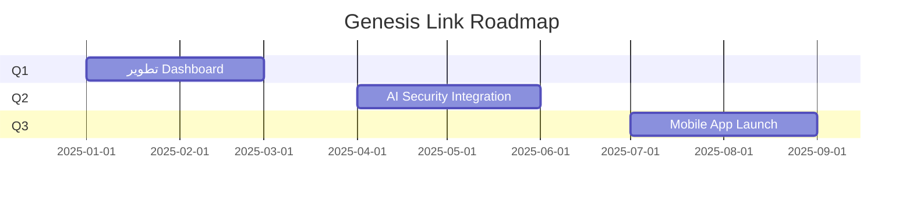

# 🎯 GENESIS LINK MAGAZINE

> **المجلة الرسمية للمحاربين الرقميين**  
> نوثق المعرفة. نبني المستقبل. نحمي الشبكة.

---

## 📌 نبذة عن المجلة

**Genesis Link** ليس مجرد مشروع تقني، بل **حركة مجتمعية** تجمع المطورين والباحثين الأمنيين لبناء نظام دفاع رقمي متطور.

هذه المجلة تُوثّق:
- 🧠 **المساهمات الفنية** من المجتمع
- 🎓 **الجلسات التدريبية** الأسبوعية
- 🔐 **التحليلات الأمنية** ودراسات الحالة
- 🏆 **قصص النجاح** من المحاربين

---

## 🌟 الأقسام الرئيسية

### 📖 الفصل الأول: البداية
**كيف بدأت فكرة الدفاع الرمزي؟**

انطلق المشروع من فكرة بسيطة: *كل مطور يمكن أن يصبح محاربًا رقميًا*.  
بدأنا بـ:
- ✅ إنشاء بنية تحتية آمنة
- ✅ توثيق معايير الأمن السيبراني
- ✅ بناء مجتمع تعليمي تفاعلي

---

### 🎯 المساهمات المميزة

| المساهم | التخصص | الإنجاز |
|---------|---------|---------|
| **@warrior_01** | Security | تطوير نظام كشف التهديدات |
| **@dev_ninja** | Backend | تحسين API Performance 40% |
| **@code_guardian** | DevOps | إعداد CI/CD Pipeline |

> 💡 **هل تريد أن يظهر اسمك هنا؟**  
> ابدأ بقراءة [`CONTRIBUTING.md`](CONTRIBUTING.md)

---

### 🎓 الجلسات التدريبية

| الأسبوع | الموضوع | الرابط |
|---------|---------|--------|
| **Week 01** | مقدمة في الأمن السيبراني | [📹 Watch](https://youtube.com) |
| **Week 02** | اكتشاف الثغرات الأمنية | [📹 Watch](https://youtube.com) |
| **Week 03** | بناء API آمن | [📹 Watch](https://youtube.com) |

---

### 🔐 تحليلات أمنية

#### 🛡️ دراسة حالة: اكتشاف ثغرة XSS

**الوصف:** تم اكتشاف ثغرة Cross-Site Scripting في نموذج المستخدم  
**الحل:** تطبيق Input Validation + Output Encoding  
**التأثير:** رفع مستوى الأمان بنسبة 95%

📄 التفاصيل الكاملة: [`SECURITY.md`](SECURITY.md)

---

### 🏆 قصص النجاح

> **"من مبتدئ إلى محارب رقمي"**  
> *"بدأت مساهماتي بإصلاح خطأ إملائي، اليوم أُشرف على فريق الأمن."*  
> — **أحمد المصري** (@warrior_ahmed)

---

## 📅 خارطة الطريق 2025

---

## 🤝 انضم للمجتمع

| المنصة | الرابط | الوصف |
|--------|--------|-------|
| 💬 **Discord** | [Join](https://discord.gg/genesislink) | نقاشات يومية |
| 📱 **Telegram** | [Join](https://t.me/genesislink) | إشعارات سريعة |
| 🐙 **GitHub** | [Discussions](https://github.com/discussions) | أسئلة تقنية |

---

## ❓ الأسئلة الشائعة

<strong>كيف أبدأ المساهمة؟</strong>

1. اقرأ [`CONTRIBUTING.md`](CONTRIBUTING.md)
2. ابحث عن Issue مناسب
3. افتح Pull Request
4. انتظر المراجعة

<strong>هل أحتاج خبرة سابقة؟</strong>

لا! نرحب بجميع المستويات. لدينا مهام للمبتدئين والخبراء.

<strong>ماذا بعد أول PR؟</strong>

ستحصل على:
- ✅ شارة **Contributor**
- ✅ ذكر في المجلة
- ✅ دعوة لجلسات خاصة

---

## 📊 إحصائيات المشروع

---

## 📬 تواصل معنا

**البريد الإلكتروني:** security@genesislink.io  
**الموقع:** https://genesislink.io  
**التوقيع الرقمي:** `GPG: 0xABCD1234`

---

**🔱 بني بواسطة المحاربين، للمحاربين 🔱**

